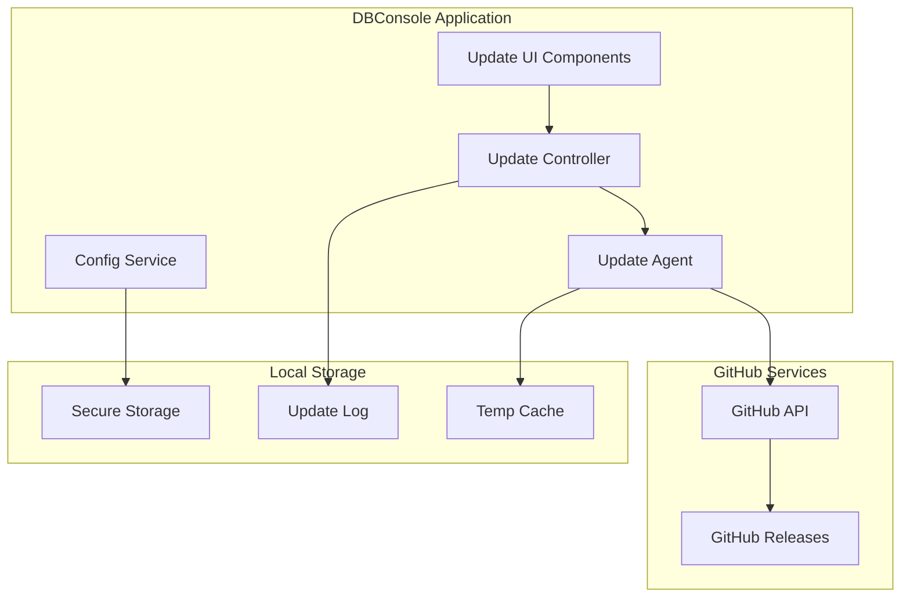
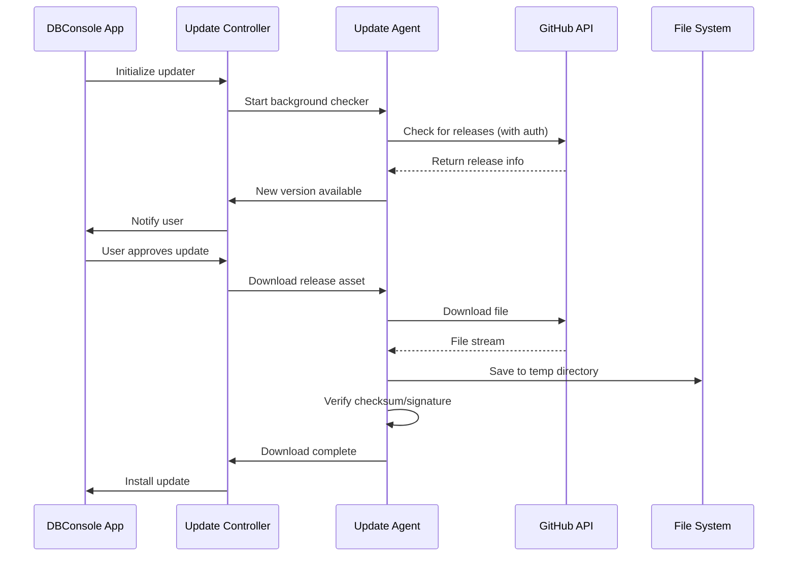

# GitHub Auto-Updater Design Document

## Overview

The GitHub Auto-Updater system provides automatic update capabilities for DBConsole, supporting both Electron desktop and Next.js web applications. The system authenticates with private GitHub repositories, checks for new releases, downloads updates, and manages the installation process with proper security verification and user experience considerations.

The updater follows a modular architecture with separate components for update checking, downloading, verification, and installation. It integrates with Electron's built-in updater capabilities while extending them to work with private repositories and custom authentication.

## Architecture

### High-Level Architecture



### Component Interaction Flow



## Components and Interfaces

### 1. Update Agent (`UpdateAgent`)

Core service responsible for communicating with GitHub API and managing update lifecycle.

```typescript
interface UpdateAgent {
  checkForUpdates(): Promise<UpdateInfo | null>
  downloadUpdate(updateInfo: UpdateInfo): Promise<string>
  verifyUpdate(filePath: string, expectedHash: string): Promise<boolean>
  installUpdate(filePath: string): Promise<void>
}

interface UpdateInfo {
  version: string
  releaseNotes: string
  downloadUrl: string
  checksum: string
  signature?: string
  publishedAt: Date
  isPrerelease: boolean
}
```

### 2. GitHub API Client (`GitHubClient`)

Handles authentication and API communication with private repositories.

```typescript
interface GitHubClient {
  authenticate(token: string): void
  getLatestRelease(owner: string, repo: string): Promise<GitHubRelease>
  getReleases(owner: string, repo: string, options?: ReleaseOptions): Promise<GitHubRelease[]>
  downloadAsset(assetUrl: string): Promise<ReadableStream>
}

interface GitHubRelease {
  id: number
  tagName: string
  name: string
  body: string
  assets: GitHubAsset[]
  prerelease: boolean
  publishedAt: string
}
```

### 3. Update Controller (`UpdateController`)

Orchestrates the update process and manages user interactions.

```typescript
interface UpdateController {
  initialize(): Promise<void>
  startBackgroundChecker(): void
  stopBackgroundChecker(): void
  checkNow(): Promise<void>
  downloadAndInstall(updateInfo: UpdateInfo): Promise<void>
  getUpdateHistory(): Promise<UpdateRecord[]>
}

interface UpdateRecord {
  version: string
  installedAt: Date
  success: boolean
  errorMessage?: string
}
```

### 4. Configuration Service (`ConfigService`)

Manages updater settings and secure credential storage.

```typescript
interface ConfigService {
  getGitHubToken(): Promise<string | null>
  setGitHubToken(token: string): Promise<void>
  getUpdateSettings(): Promise<UpdateSettings>
  setUpdateSettings(settings: UpdateSettings): Promise<void>
}

interface UpdateSettings {
  autoCheck: boolean
  autoInstall: boolean
  checkInterval: number // hours
  updateChannel: 'latest' | 'prerelease' | 'custom'
  customTagPattern?: string
  maintenanceWindow?: TimeWindow
}
```

## Data Models

### Update Manifest

```typescript
interface UpdateManifest {
  version: string
  platform: 'darwin' | 'win32' | 'linux'
  arch: 'x64' | 'arm64'
  files: {
    [platform: string]: {
      url: string
      size: number
      checksum: string
      signature?: string
    }
  }
  releaseNotes: string
  minimumVersion?: string
  forceUpdate: boolean
}
```

### Security Verification

```typescript
interface SecurityVerification {
  checksumAlgorithm: 'sha256' | 'sha512'
  checksum: string
  signatureAlgorithm?: 'rsa' | 'ecdsa'
  signature?: string
  publicKey?: string
}
```

## Correctness Properties

*A property is a characteristic or behavior that should hold true across all valid executions of a system-essentially, a formal statement about what the system should do. Properties serve as the bridge between human-readable specifications and machine-verifiable correctness guarantees.*

<function_calls>
<invoke name="prework">
<parameter name="featureName">github-auto-updater

Property 1: Update check timing consistency
*For any* application startup, the updater should initiate an update check within 30 seconds of launch
**Validates: Requirements 1.1**

Property 2: Periodic check interval adherence
*For any* configured check interval, the updater should perform background checks at the specified frequency (±5% tolerance)
**Validates: Requirements 1.2**

Property 3: Authentication header presence
*For any* GitHub API request, the request should include valid authentication headers with the configured Personal Access Token
**Validates: Requirements 1.3**

Property 4: Version comparison accuracy
*For any* pair of semantic versions, the version comparison should correctly identify which version is newer using semantic versioning rules
**Validates: Requirements 1.4**

Property 5: Update notification consistency
*For any* scenario where a newer version is available, the system should notify the user and provide download options
**Validates: Requirements 1.5**

Property 6: Token format validation
*For any* Personal Access Token input, the system should validate the token format and accept only properly formatted GitHub tokens
**Validates: Requirements 2.1**

Property 7: Credential encryption invariant
*For any* stored Personal Access Token, the token should never be stored in plaintext and should be retrievable only through secure storage APIs
**Validates: Requirements 2.2**

Property 8: Configuration persistence
*For any* update preference setting, the configuration should be persisted and retrievable across application restarts
**Validates: Requirements 2.3**

Property 9: Channel filtering consistency
*For any* configured update channel, only releases matching that channel criteria should be considered for updates
**Validates: Requirements 2.4**

Property 10: Authentication error handling
*For any* invalid or expired authentication credentials, the system should display clear error messages and prevent update operations
**Validates: Requirements 2.5**

Property 11: Platform-specific asset selection
*For any* available update with multiple platform assets, the system should select the asset matching the current platform and architecture
**Validates: Requirements 3.1**

Property 12: File integrity verification
*For any* downloaded update file, the system should verify the file's checksum matches the expected hash before proceeding with installation
**Validates: Requirements 3.2**

Property 13: Web app version notification
*For any* web application instance detecting a version mismatch, the system should display appropriate update notifications to the user
**Validates: Requirements 3.5**

Property 14: Exponential backoff retry behavior
*For any* network failure during update checks, the system should retry with exponentially increasing delays up to the maximum retry count
**Validates: Requirements 4.1**

Property 15: Rate limit compliance
*For any* GitHub API rate limit response, the system should respect the rate limit headers and delay subsequent requests appropriately
**Validates: Requirements 4.2**

Property 16: Download resumption capability
*For any* interrupted download that supports range requests, the system should resume from the last successful byte position
**Validates: Requirements 4.3**

Property 17: Adaptive check interval behavior
*For any* series of consecutive update check failures, the system should increase the check interval to reduce server load
**Validates: Requirements 4.4**

Property 18: Offline detection and handling
*For any* offline network condition, the system should skip update checks and resume when connectivity is restored
**Validates: Requirements 4.5**

Property 19: Download progress reporting
*For any* active download, the system should emit progress events with accurate percentage and estimated time remaining
**Validates: Requirements 5.1**

Property 20: Release notes retrieval
*For any* available update, the system should fetch and display the associated release notes from the GitHub release
**Validates: Requirements 5.2**

Property 21: Update completion notification
*For any* successfully completed update, the system should display a notification containing the new version number and key changes
**Validates: Requirements 5.4**

Property 22: Update history persistence
*For any* completed update operation, the system should record the update in the history log with timestamp and outcome
**Validates: Requirements 5.5**

Property 23: Checksum verification consistency
*For any* downloaded release asset, the system should verify the file checksum against the published hash before installation
**Validates: Requirements 6.1**

Property 24: Digital signature validation
*For any* release asset with digital signatures, the system should validate the signature using the appropriate public key
**Validates: Requirements 6.2**

Property 25: Signature failure rejection
*For any* file with invalid or missing required signatures, the system should reject the update and alert the user
**Validates: Requirements 6.3**

Property 26: Checksum retry logic
*For any* file with checksum mismatch, the system should re-download up to 2 times before marking the update as failed
**Validates: Requirements 6.4**

Property 27: Update check policy enforcement
*For any* administrative policy disabling automatic updates, the system should not perform background update checks
**Validates: Requirements 7.1**

Property 28: Check frequency policy compliance
*For any* configured update frequency policy, the system should respect the specified check intervals
**Validates: Requirements 7.2**

Property 29: Installation policy adherence
*For any* policy disabling automatic installation, the system should only notify users without installing updates
**Validates: Requirements 7.3**

Property 30: Maintenance window compliance
*For any* configured maintenance window, the system should only install updates during the specified time periods
**Validates: Requirements 7.4**

Property 31: Policy precedence consistency
*For any* conflict between enterprise policies and user preferences, the system should prioritize enterprise policies
**Validates: Requirements 7.5**

## Error Handling

### Network Error Handling
- **Connection timeouts**: Implement configurable timeout values with exponential backoff
- **Rate limiting**: Parse GitHub API rate limit headers and implement appropriate delays
- **Authentication failures**: Provide clear error messages and guidance for token renewal
- **Download interruptions**: Support resumable downloads using HTTP range requests

### File System Error Handling
- **Insufficient disk space**: Check available space before downloading updates
- **Permission errors**: Handle cases where the application lacks write permissions
- **Corrupted downloads**: Implement checksum verification and automatic retry logic
- **Installation failures**: Provide rollback mechanisms to restore previous versions

### Configuration Error Handling
- **Invalid settings**: Validate configuration values and provide sensible defaults
- **Missing credentials**: Guide users through the authentication setup process
- **Policy conflicts**: Resolve conflicts between user preferences and administrative policies

## Testing Strategy

### Unit Testing Approach
The testing strategy employs both unit tests and property-based tests to ensure comprehensive coverage:

**Unit Tests** will cover:
- Specific examples of version comparison logic
- Authentication token validation with known good/bad tokens
- Configuration persistence with specific settings
- Error handling with predetermined failure scenarios
- UI component behavior with mock data

**Property-Based Testing Framework**: fast-check (JavaScript/TypeScript)
- Minimum 100 iterations per property test
- Each property test tagged with format: `**Feature: github-auto-updater, Property {number}: {property_text}**`

**Property-Based Tests** will verify:
- Version comparison correctness across all semantic version combinations
- Authentication header presence across all API request types
- Download progress reporting accuracy across various file sizes and network conditions
- Retry logic behavior across different failure patterns
- Configuration persistence across all valid setting combinations
- Security verification across various file integrity scenarios

### Integration Testing
- **GitHub API integration**: Test with real GitHub API using test repositories
- **File system operations**: Test download, verification, and installation processes
- **Electron integration**: Test updater integration with Electron's built-in mechanisms
- **Cross-platform compatibility**: Test on macOS, Windows, and Linux environments

### Security Testing
- **Credential storage**: Verify tokens are encrypted and never stored in plaintext
- **File integrity**: Test checksum and signature verification with tampered files
- **Network security**: Ensure all communications use HTTPS and proper certificate validation
- **Input validation**: Test with malformed API responses and invalid configuration data

## Implementation Notes

### Electron Integration
The updater will integrate with Electron's `autoUpdater` module while extending it to support private repositories:

```typescript
// Extend Electron's autoUpdater for private repo support
class PrivateRepoUpdater extends EventEmitter {
  private electronUpdater = require('electron-updater').autoUpdater
  private githubClient: GitHubClient
  
  async checkForUpdatesAndNotify(): Promise<void> {
    // Custom implementation for private repos
    const updateInfo = await this.githubClient.getLatestRelease()
    if (this.isNewerVersion(updateInfo.version)) {
      this.emit('update-available', updateInfo)
    }
  }
}
```

### Web Application Updates
For the Next.js web application, implement a service worker-based update mechanism:

```typescript
// Service worker registration for web app updates
class WebAppUpdater {
  async checkForUpdates(): Promise<void> {
    const response = await fetch('/api/app-info')
    const { version } = await response.json()
    
    if (this.isNewerVersion(version)) {
      this.showUpdateNotification()
    }
  }
}
```

### Security Considerations
- Store GitHub tokens using Electron's `safeStorage` API or system keychain
- Implement certificate pinning for GitHub API communications
- Validate all downloaded files using SHA-256 checksums minimum
- Support code signing verification for enhanced security

### Performance Optimizations
- Implement delta updates for smaller download sizes when possible
- Use compression for update packages
- Cache release information to reduce API calls
- Implement background downloading to minimize user wait times